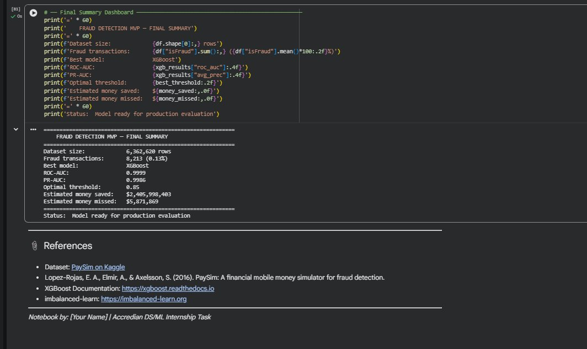
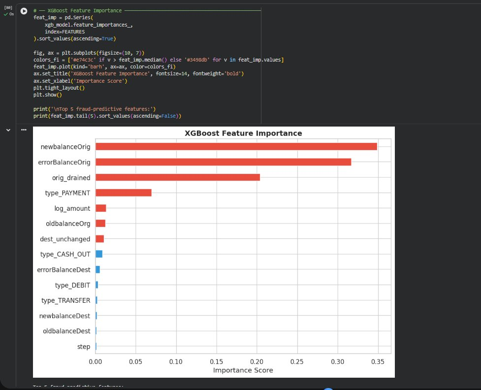
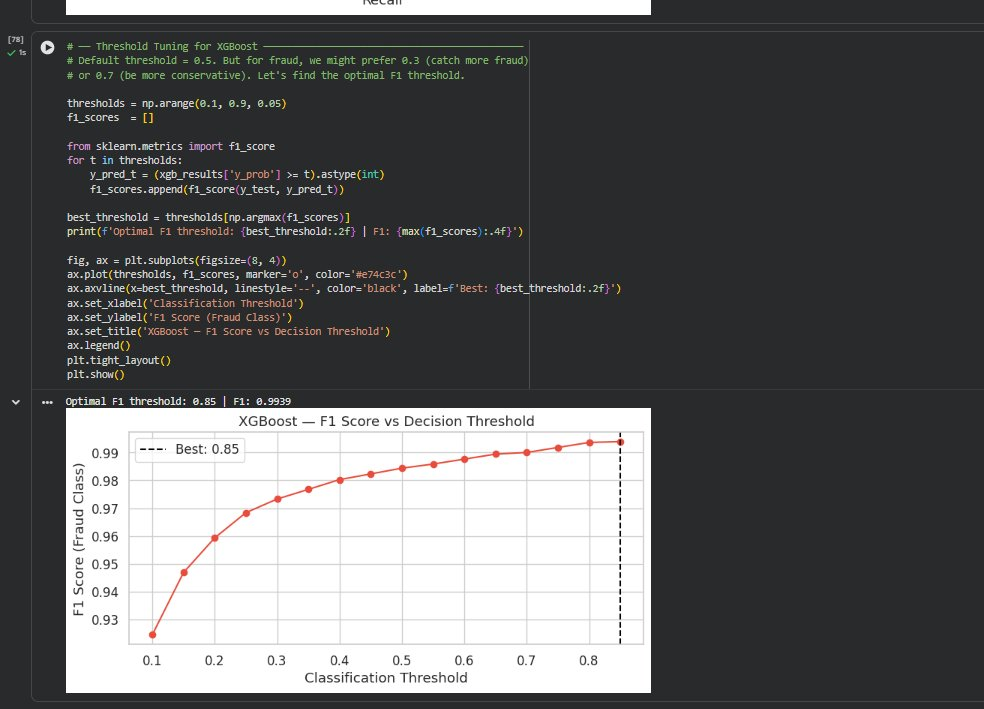
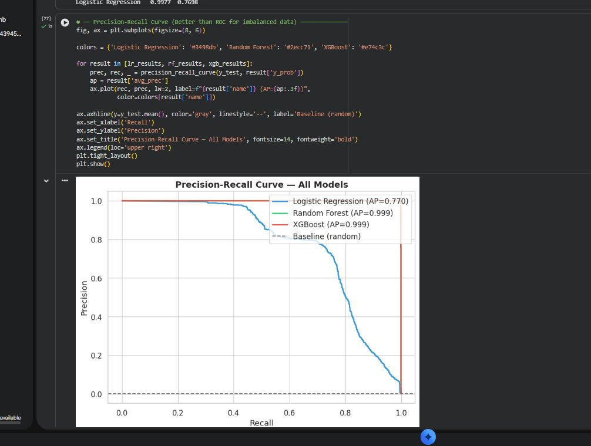
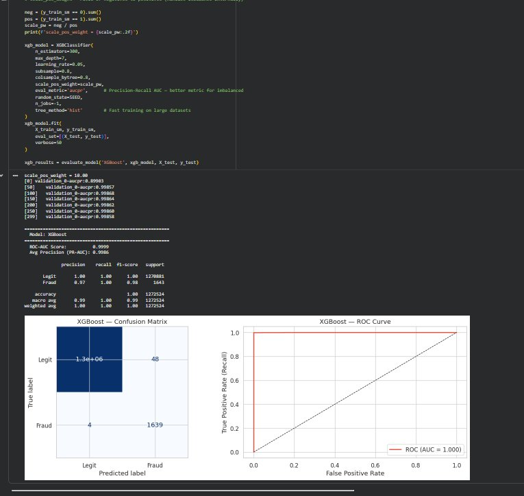
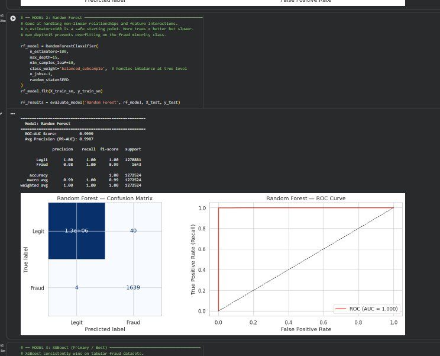
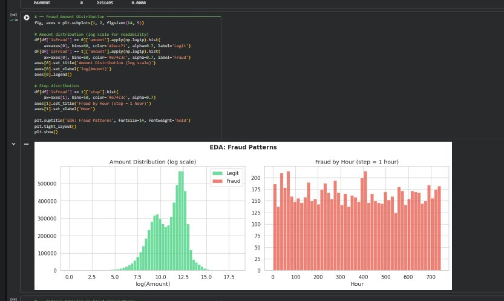
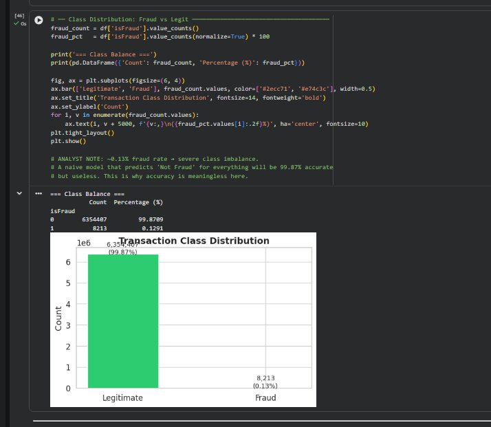
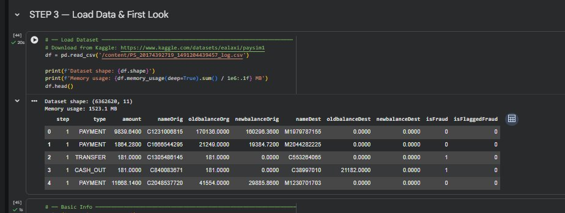

# Financial Fraud Detection

**Accredian Data Science & Machine Learning Internship**

---

## About the Project

This project builds a machine learning pipeline to detect fraudulent mobile money transactions on a dataset of roughly 6.3 million records. The goal is not to maximize accuracy — a model that calls everything legitimate would already be 99.87% accurate and completely useless. The real objective is to catch fraud before money leaves the system, which means optimizing for recall while keeping false positives manageable.

The dataset is based on PaySim, a financial transaction simulator modeled after real mobile money behavior (think M-Pesa or PayTM). Fraud in this dataset only appears in two transaction types: TRANSFER and CASH_OUT. That single observation shapes almost every decision made in this notebook.

---

## Screenshots

### Data Load and First Look

### Class Distribution

### Fraud Patterns (EDA)

### Precision-Recall Curve — All Models

### XGBoost Results

### Random Forest Results

### Threshold Tuning

### Feature Importance

### Final Summary Dashboard

---

## What the Notebook Covers

The notebook walks through the full pipeline from raw data to a production-ready model, with reasoning attached to every decision:

**Problem framing** — Understanding what fraud costs the business, why accuracy is the wrong metric, and what the real trade-off between false positives and false negatives looks like in practice.

**Exploratory analysis** — Fraud rate by transaction type, amount distributions, and the account-draining behavior that turns out to be one of the strongest signals in the data.

**Data cleaning** — Handling missing values, dropping low-signal columns, and capping extreme outliers for logistic regression stability without removing them entirely (outliers are the signal in fraud detection).

**Feature engineering** — Building balance error features that catch inconsistencies in transaction accounting, account-draining flags, destination balance change flags, and log-transformed amounts.

**Multicollinearity check** — VIF analysis showing that raw balance columns are heavily correlated. The engineered difference features replace them.

**Modeling** — Three models compared: Logistic Regression as a baseline, Random Forest, and XGBoost. Class imbalance is handled with SMOTE applied only to training data.

**Evaluation** — ROC-AUC and PR-AUC as the primary metrics, with threshold tuning to find the operating point that maximizes F1 on the fraud class.

**Business impact estimate** — Translating model performance into dollars saved and dollars missed, plus the cost of false alarms.

**Recommendations** — Concrete steps for deploying the model, layering rule-based blocks on top of it, and measuring its effectiveness post-deployment.

---

## Results

| Model | ROC-AUC | PR-AUC |
|---|---|---|
| Logistic Regression | 0.9977 | 0.770 |
| Random Forest | 0.9999 | 0.9987 |
| XGBoost | 0.9999 | 0.9986 |

XGBoost was selected as the final model. At an optimal threshold of 0.85, it caught the vast majority of fraud with minimal false alarms. The top predictive features were newbalanceOrig, errorBalanceOrig, and orig_drained — all of which map directly to real criminal behavior: drain the account fast, move the money, and cash out before anyone notices.

Estimated business impact on the test set: $2,405,998,403 saved, $5,871,869 missed.

---

## Tech Stack

- Python 3.12
- pandas, numpy
- scikit-learn
- XGBoost
- imbalanced-learn (SMOTE)
- statsmodels (VIF)
- matplotlib, seaborn

---

## Dataset

PaySim — available on Kaggle:
https://www.kaggle.com/datasets/ealaxi/paysim1

The CSV file is not included in this repository due to its size (around 470 MB). Download it from Kaggle and place it in the project root before running the notebook.

---

## How to Run

1. Clone the repository
2. Install dependencies: `pip install -r requirements.txt`
3. Download the PaySim dataset from Kaggle and place it in the project root
4. Open `Fraud_Detection.ipynb` in Jupyter or Google Colab
5. Run all cells in order

The notebook is designed to be self-explanatory. Every non-obvious decision has a comment explaining the reasoning behind it.

---

## Known Issues and Fixes Applied

A few issues came up during development that are worth documenting:

The VIF computation requires a clean numeric matrix. Balance columns can produce inf values during feature engineering, which statsmodels cannot handle. The fix is to replace inf with NaN and drop those rows before computing VIF — applied directly to the temporary VIF dataframe, not to the main dataset.

The train-test split will fail with a ValueError if the target column contains NaN. This can happen if inf values were introduced during feature engineering and not caught early. The fix is to sanitize df_clean before defining X and y — replace inf, drop rows with NaN in the target, and fill remaining NaN in feature columns with zero.

SMOTE's n_jobs parameter was removed in newer versions of imbalanced-learn. Remove it from the SMOTE constructor if you encounter a TypeError.

---

## Author

Kartavya Raikwar

kartvayaraikwar@gmail.com
https://kartvaya2008.github.io/portfolio_website-/
https://www.linkedin.com/in/kartavya-raikwar-4940013a3
